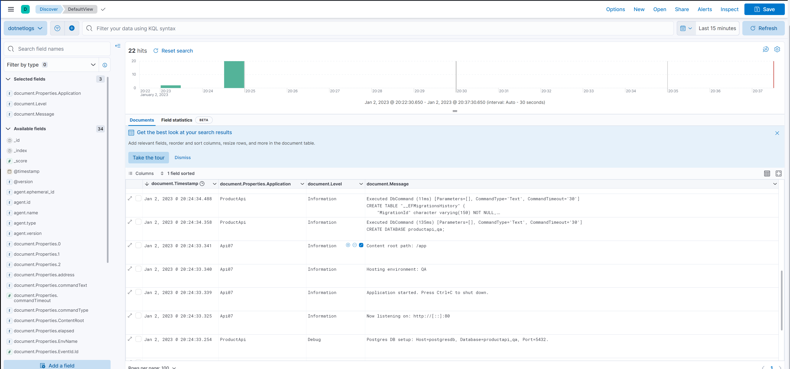

# ELK-from-RUSSIA-with-Love

Right now you can't pull ELK images from Russia 

If you try to run

```
docker pull docker.elastic.co/elasticsearch/elasticsearch-oss:7.9.3
```

you will get:

```
Amazon CloudFront distribution is configured to block access from your country.
```

## This solution will help avoid this mess

It enables using ELK containers from russia

You only need to use images from bitnami or build them yourself.

In future I'll publish proxy settings to bypass the block from Amazon Cloudfront


## Startup commands
```
docker-compose -f docker-compose.elk.yml build --progress plain --no-cache
docker-compose -f docker-compose.elk.yml up --no-color --force-recreate
```

## Kibana startup url
http://localhost:5601/

Stack Management -> Data views. Click "Create data view" button, select index pattern dotnetlogs and save new view.



## Help commands
```
docker-compose -f docker-compose.elk.yml build --progress plain --no-cache logstash

docker ps -a --filter "ancestor=elas" --format "{{.ID}}"
docker rm $(docker ps -qa --no-trunc --filter "status=exited")
docker rmi -f $(docker images prod* --format "{{.ID}}")
docker images file* --format "{{.ID}}
```
